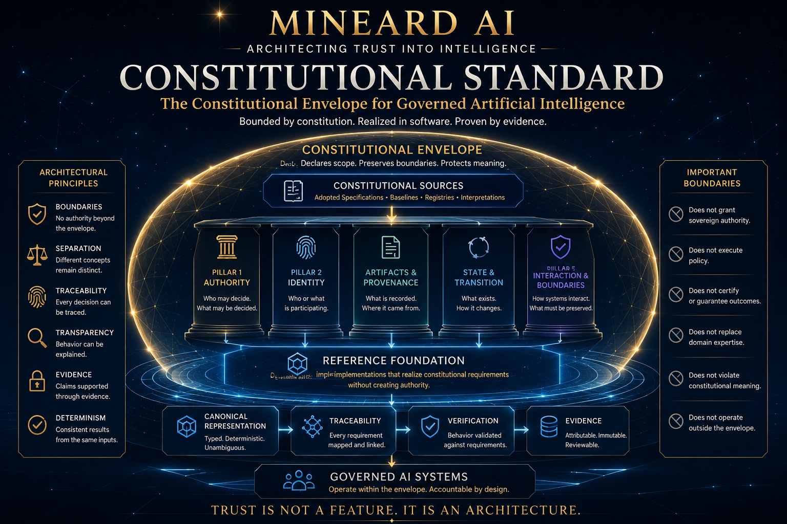

# Constitutional Standard

Constitutional Standard is a constitutional envelope and deterministic Reference Foundation for governed artificial intelligence. It gives AI systems a typed, inspectable way to carry source, scope, authority-boundary, provenance, verification, evidence, and lifecycle context without becoming an execution engine or source of authority.



A small, non-sovereign foundation for making governed AI operations explicit, reproducible, and reviewable.

## What it is

The project provides a bounded, typed Rust realization of the records and checks needed to describe an AI operation in constitutional context. It makes source admission, authority boundaries, identity and participation, artifact provenance, state, interaction boundaries, canonical representation, traceability, verification, evidence, release continuity, and operational-recognition records explicit and inspectable.

It is a reference implementation, not an adopted constitution or operating system for AI.

## Why it exists

Governed AI needs more than an input and an output. A reviewable operation also needs a declared source set, baseline, jurisdiction, scope, effective times, implementation version, provenance, verification obligations, evidence references, and explicit limits on what a record means.

Constitutional Standard supplies deterministic data structures and validation boundaries for those concerns. The result can be inspected, tested, serialized, and connected to a larger governed system while remaining separate from that system's authority and execution paths.

## Current implementation

The current public implementation is `reference-foundation-0.15.0`. It contains the following bounded domains:

| Domain | Implemented responsibility |
| --- | --- |
| Contracts | Shared identifiers, references, findings, times, and implementation records |
| Source admission | Typed admission records with fail-closed conflict handling |
| Context | Operation-scoped source, baseline, jurisdiction, scope, time, and boundary resolution |
| Authority | Authority evaluation records with claims, basis, findings, and non-claims |
| Identity and participation | Canonical records without asserting real-world identity or agency |
| Artifacts and provenance | Artifact references, origin, custody, and provenance |
| State and transition | Typed state and transition records with bounded findings |
| Interaction and boundary | Interaction records and explicit boundary conditions |
| Canonical representation | Strict line-oriented encoding, decoding, validation, and identity digests |
| Traceability | Source-to-requirement-to-component-to-test/evidence mappings and graph checks |
| Verification and assurance | Typed activities, findings, assessments, and bounded assurance results |
| Evidence and provenance | Evidence objects, origin, custody, integrity, conflict, and sufficiency boundaries |
| Release continuity | Release records, compatibility, impact, and continuity relationships |
| Activation and recognition | Typed records that remain non-executing and non-authoritative |

These domains record and validate declared information. They do not infer constitutional meaning, invoke represented components, persist state, transport messages, or perform an operation.

## Architecture

The workspace is organized as small Rust crates with explicit responsibilities:

```text
constitutional-contracts  -> shared types and findings
constitutional-source-admission -> constitutional-context -> constitutional-core
constitutional-authority, identity, artifacts, state, interaction
constitutional-canonical <-> constitutional-validation
constitutional-traceability, evidence, release, activation
```

The arrows show the workspace relationships represented by the crate manifests; the final line groups the lifecycle and evidence-oriented crates. `constitutional-test-support` provides shared fixtures for tests. See the [component catalog](implementation/docs/COMPONENT_CATALOG.md) and [responsibility matrix](implementation/docs/COMPONENT_RESPONSIBILITY_MATRIX.md) for the public crate boundaries.

## Determinism, evidence, and continuity

Canonical representations use an explicit format and version, ordered fields, typed values, strict decoding, and stable identity digests. Non-canonical input is rejected rather than normalized silently. This supports repeatable comparison and evidence binding within the reference profile; it is not a universal wire protocol or a substitute for constitutional interpretation.

Traceability records relationships among sources, requirements, components, artifacts, implementation versions, verification activities, evidence, gates, and lifecycle records. Verification and evidence records preserve what was checked, against which scope and implementation version, and with which findings.

Release continuity and activation records describe declared compatibility, lifecycle relationships, activation conditions, and operational-recognition boundaries. All of these are records and checks; none performs the action it describes.

## Design boundaries

The Reference Foundation is deliberately non-sovereign and non-executing:

- it does not create or transfer constitutional authority;
- it does not adopt or amend a constitution;
- it does not decide whether a constitutional source is substantively correct;
- it does not execute AI actions, make operational decisions, or compel downstream behavior;
- it does not provide transport, persistence, deployment, orchestration, secrets management, or a production control plane.

Unknown, missing, conflicting, ambiguous, or out-of-scope inputs are represented as typed findings or indeterminate results where the relevant API requires it. The foundation does not turn those records into authority, certification, conformance, or operational effectiveness.

## Start with the implementation

- [`implementation/Cargo.toml`](implementation/Cargo.toml) — Rust workspace manifest.
- [`implementation/crates/`](implementation/crates/) — public implementation crates and tests.
- [`implementation/docs/`](implementation/docs/) — realization profiles, boundaries, component records, and implementation documentation.
- [`implementation/evidence/`](implementation/evidence/) — implementation evidence records associated with the public realization.
- [`implementation/docs/IMPLEMENTATION_SCOPE.md`](implementation/docs/IMPLEMENTATION_SCOPE.md) — bounded scope and exclusions.
- [`implementation/docs/CANONICAL_ENCODING_PROFILE.md`](implementation/docs/CANONICAL_ENCODING_PROFILE.md) — canonical encoding profile.
- [`implementation/docs/TRACEABILITY_BOUNDARY_AND_NON_AUTHORITY.md`](implementation/docs/TRACEABILITY_BOUNDARY_AND_NON_AUTHORITY.md) — traceability limits.
- [`implementation/docs/VERIFICATION_AND_ASSURANCE_NON_AUTHORITY.md`](implementation/docs/VERIFICATION_AND_ASSURANCE_NON_AUTHORITY.md) — verification and assurance limits.

## Usage

The workspace is library-first. For example, a consumer can construct a validated trace reference using the public traceability API:

```rust
use constitutional_traceability::TraceRef;

let reference = TraceRef::new("evidence/EV-001").expect("reference must be non-empty and whitespace-free");
assert_eq!(reference.as_str(), "evidence/EV-001");
```

The implementation also exposes typed context resolution and canonical representation APIs. Applications should build those records from their own admitted inputs and treat indeterminate results and validation findings as meaningful outcomes, not as permission to guess.

## Build and verify

From the `implementation` directory:

```text
cargo fmt --all -- --check
cargo test --workspace --all-features
cargo clippy --workspace --all-targets --all-features -- -D warnings
```

The workspace targets Rust edition 2024 and forbids unsafe Rust at the workspace lint level. Generated build output is not part of the repository.

## Status and limitations

`reference-foundation-0.15.0` is the current implementation version represented by the public workspace. It is a bounded reference implementation, not a 1.0 authorization, constitutional adoption, certification, or production release.

It does not supply constitutional source interpretation, governance policy, external identity proofing, an execution runtime, deployment automation, persistence, transport, a registry, a security boundary, or operational authority. Integrators remain responsible for source governance, infrastructure, threat modeling, access control, data handling, and deployment decisions.

## Contributing

Contributions should preserve the explicit, typed, deterministic, non-sovereign, and non-executing boundaries of the project. Keep changes scoped to the affected crate, add behavioral tests for new behavior, document any new limitation or non-claim, and run the formatting, workspace test, and Clippy commands above before submitting a change.

There is not currently a separate contribution policy in this repository. The implementation and its public boundary documents are the source of truth for supported behavior.

## Security

Do not commit credentials, private keys, personal data, or production evidence to this repository. See [`SECURITY.md`](SECURITY.md) for private vulnerability-reporting instructions.

## License

This project is licensed under the [Apache License, Version 2.0](LICENSE). The workspace metadata identifies the implementation and its member crates as `Apache-2.0`. See [`NOTICE`](NOTICE) for the project attribution notice.
